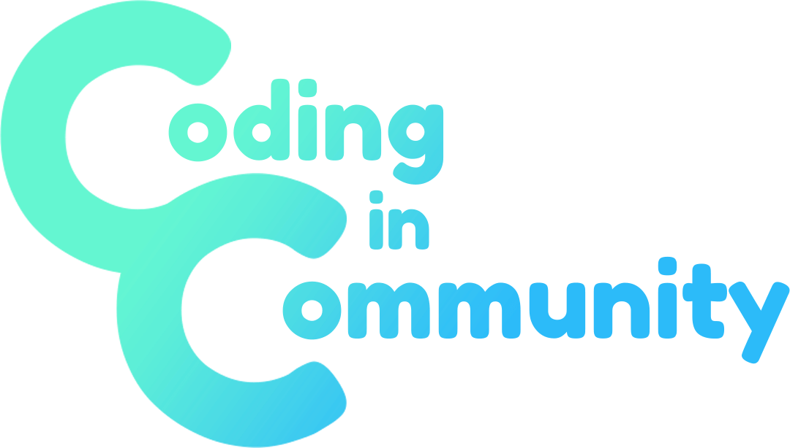

<h1 align="center">
   Exercícios - CeV
</h1>

   

   <b><i>Oferecido por</i></b>  
   

---

   **Linguagens utilizadas atualmente**

   

   

   

   
   
   

   

   

   
   
   

---

## O que vai encontrar aqui? 👀

Esse repositório é dedicado a armazenar todos os enunciados e soluções dos exercícios do [Curso de Python 3](https://www.youtube.com/playlist?list=PLHz_AreHm4dm6wYOIW20Nyg12TAjmMGT-) do canal [Curso em Vídeo](https://www.cursoemvideo.com/) em diversas linguagens de programação.

## Index dos Mundos 🌎

- **Mundo 1 - Fundamentos**  
   - [Enunciados](exs/mundo_1/enunciados.md#enunciados---mundo-1)  
   - [Resoluções](exs/mundo_1/readme.md#linguagens)
- **Mundo 2 - Estrutura de Controle**  
   - [Enunciados](exs/mundo_2/enunciados.md#enunciados---mundo-2)  
   - [Resoluções](exs/mundo_2/readme.md#linguagens)
- **Mundo 3 - Estruturas Compostas**  
   - [Enunciados](exs/mundo_3/enunciados.md#enunciados---mundo-3)  
   - [Resoluções](exs/mundo_3/readme.md#linguagens)

## Contribuidores 🖖

| [ @BearingMe](https://github.com/BearingMe) | [ @carlos3g](https://github.com/carlos3g) | [ @matheusfelipeog](https://github.com/matheusfelipeog) |  [ @KevinAp-5](https://github.com/KevinAp-5) |  [ @QuatroQuatros](https://github.com/QuatroQuatros) |  [ @Typhz](https://github.com/Typhz) | 
|:-:|:-:|:-:|:-:|:-:|:-:|
| [ @LeonardoCruzx](https://github.com/LeonardoCruzx) | [ @Mr0l3](https://github.com/Mr0l3) | 

## Contribuindo 🤝

Todo tipo de contribuição é bem-vinda, nós admiramos isso!

Tem algum problema? Encontrou um bug ou exercício incorreto? Tem alguma dica? Abra uma [issue](https://github.com/Coding-in-community/exercicios-CeV/issues) descrevendo.

Quer contribuir com código? Pedimos que antes leia [CONTRIBUTING.md](https://github.com/Coding-in-community/exercicios-CeV/blob/master/CONTRIBUTING.md#guia-para-contribuidores)

Não esqueça de deixar a sua ⭐, também é um modo de contribuir com o projeto ;)

## Licença 📜

Este repositório usa a licença MIT, para mais informações consulte em [LICENSE](https://github.com/Coding-in-community/exercicios-CeV/blob/master/LICENSE)
